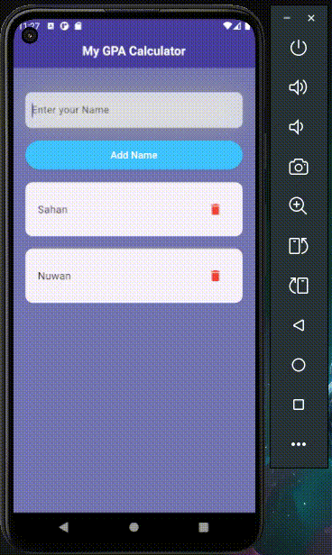

# GPA Calculator App

A Flutter application to calculate and manage student GPAs with multiple user support.

## Features

- Multiple user support with individual GPA tracking
- Add, edit, and delete modules for each user
- Real-time GPA calculation
- SQLite database for persistent storage
- Material Design UI

## Demo 🎥



---

## Getting Started

### Prerequisites

- Flutter (Latest version)
- Dart SDK
- Android Studio / VS Code
- Git

### Installation

1. Clone the repository
```bash
git clone https://github.com/kbimsara/gpa-Calculator-flutter.git
```

2. Install dependencies
```bash
flutter pub get
```

3. Run the app
```bash
flutter run
```

### Dependencies

- sqflite: ^2.3.0
- path: ^1.8.3

## Database Schema

### Users Table
```sql
CREATE TABLE users(
  id INTEGER PRIMARY KEY AUTOINCREMENT,
  name TEXT NOT NULL
)
```

### Modules Table
```sql
CREATE TABLE modules(
  id INTEGER PRIMARY KEY AUTOINCREMENT,
  user_id INTEGER,
  module_name TEXT NOT NULL,
  credit INTEGER NOT NULL,
  result TEXT NOT NULL,
  FOREIGN KEY (user_id) REFERENCES users (id)
)
```

## Grade Points

| Grade | Points |
|-------|---------|
| A+    | 4.0     |
| A     | 4.0     |
| A-    | 3.7     |
| B+    | 3.3     |
| B     | 3.0     |
| B-    | 2.7     |
| C+    | 2.3     |
| C     | 2.0     |
| C-    | 1.7     |
| D+    | 1.3     |
| D     | 1.0     |
| E     | 0.7     |

## Features Implementation

### User Management
- Create new users
- View all users
- Delete users and their associated modules

### Module Management
- Add modules with credits and grades
- Edit existing modules
- Delete modules
- Real-time GPA calculation

### Data Persistence
- SQLite database integration
- Cascade deletion for user data
- Transaction support for data integrity

## Project Structure

```
lib/
  ├── Models/
  │   └── dbHelper.dart
  ├── Components/
  │   ├── userCard.dart
  │   └── userGpaCard.dart
  ├── Pages/
  │   ├── homePage.dart
  │   └── viewPage.dart
  └── main.dart
```

## ⚠️ Important Notice
**This application is designed for mobile platforms only (Android) and CANNOT run as a web application.**

The reason for this limitation:
- The app uses SQLite database through the `sqflite` package which is not supported in web browsers

Please run this application on:
- Android devices/emulators